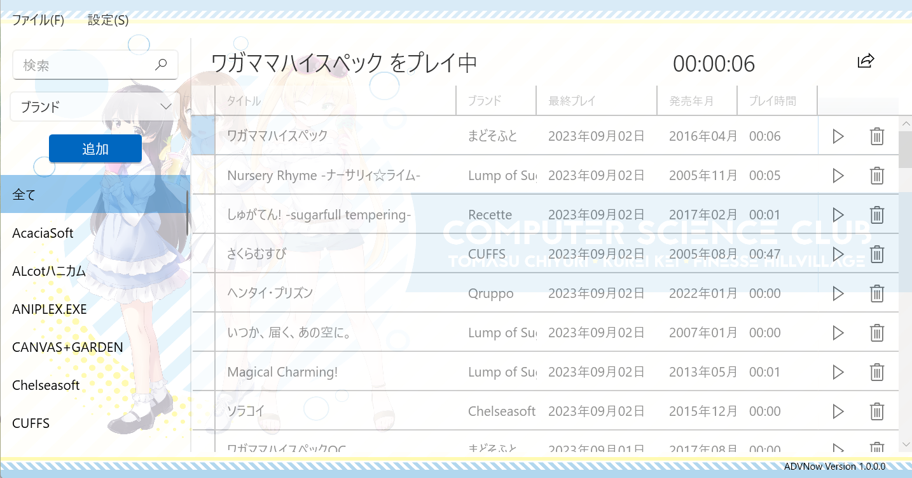
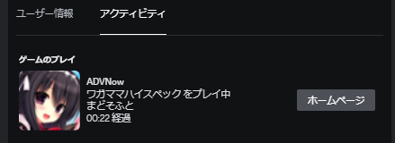
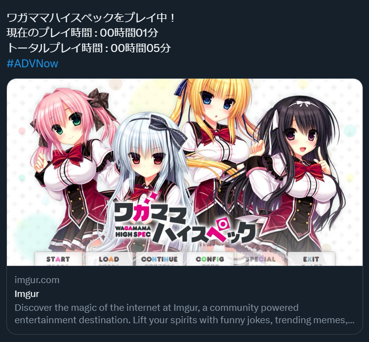

# ADVNow
ADVNow はシンプルで使いやすい美少女ゲーム専用のランチャーです。

# 機能
* 美少女ゲームのランチャー機能

* 累計プレイ時間・最終プレイ日時の管理

* ブランド・発売年毎での一覧表示

* 背景画像の設定機能

* Discord 上でプレイ状況の表示

* スクリーンショット画像を X へシェア

# 追加予定の機能
* スクリーンショットの管理機能

* データベースの自動更新機能

# FAQ
### メモリを大量に消費してしまう
初回起動時には [ErogameScape -エロゲー批評空間-](https://erogamescape.dyndns.org/~ap2/ero/toukei_kaiseki/) のデータベースをローカルに保存するため、一時的にメモリに多くのデータを保存します。ローカル内にデータベースが保存されるとメモリ内のデータは解放されます。

### 質問やプルリクエストは受け付けていますか
大歓迎です！質問やバグなどを発見した場合は [Issues](https://github.com/towa0131/ADVNow/issues) で報告いただけると幸いです！